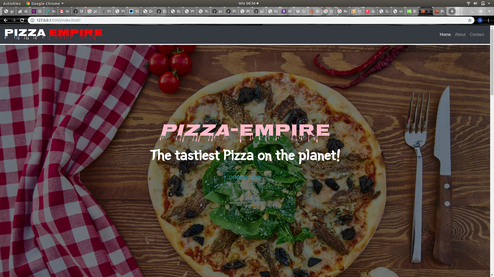

# Pizza-Empire.

## DESCRIPTION

- This is a  `Pizza-Website`. It is for Pizza-Empire shop whereby it displays services and what The shop has to offer. It is  also a platform for one to Order and have pizza delivered Online.

## Deployment

- You can vist the site directly by clicking [HERE](https://skimanikings.github.io/Pizza-Empire-/)
- To view the source codes on github click [HERE](https://github.com/SkimaniKings/Pizza-Empire-)

## Project Screenshot

 
- This is the landing page of the website.

## Technologies Used
- html
 - css
 - javascript
 - bootsrap 
 - jquery
 
 ## Acknowledgement 
 I would like to thank the following for their assistance through out this project.
  - The Almighty God
  - Collegues for their assistance in the project
  - And finally Myself :-)

## Licence

The MIT License (MIT)

Copyright (c) 2019 Simon Kimani.

Permission is hereby granted, free of charge, to any person obtaining a copy of this software and associated documentation files (the "Software"), to deal in the Software without restriction, including without limitation the rights to use, copy, modify, merge, publish, distribute, sublicense, and/or sell copies of the Software, and to permit persons to whom the Software is furnished to do so, subject to the following conditions:

The above copyright notice and this permission notice shall be included in all copies or substantial portions of the Software.

THE SOFTWARE IS PROVIDED "AS IS", WITHOUT WARRANTY OF ANY KIND, EXPRESS OR IMPLIED, INCLUDING BUT NOT LIMITED TO THE WARRANTIES OF MERCHANTABILITY, FITNESS FOR A PARTICULAR PURPOSE AND NONINFRINGEMENT. IN NO EVENT SHALL THE AUTHORS OR COPYRIGHT HOLDERS BE LIABLE FOR ANY CLAIM, DAMAGES OR OTHER LIABILITY, WHETHER IN AN ACTION OF CONTRACT, TORT OR OTHERWISE, ARISING FROM, OUT OF OR IN CONNECTION WITH THE SOFTWARE OR THE USE OR OTHER DEALINGS IN THE SOFTWARE.

@SkimaniKings

## Contacts

- Incase of any feedback you can reach me through my personal contacts:
  - kimanisimon856@gmail.com
  - 0713813919

## Author

> **Simon Kimani**